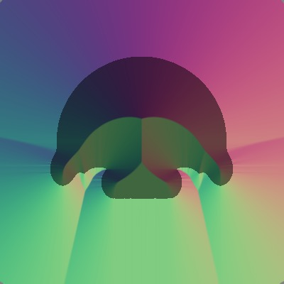

# 2D Sculpting

To see the results of the python implementation, run
```
python canvas.py
```
There will be a series of plots, each showing steps in the construction of various shapes (CSG operations followed by signed distance field updates, then shrinking and fattening).

To run the Julia tests, install IJulia with
```
Pkg.add("IJulia")
using IJulia
notebook()
```
in the Julia REPL. Then you can run `include("canvas.jl")` in a new notebook, or see the existing notebook in this directory.
Here is an example of the output of the sculpting prototype system:

