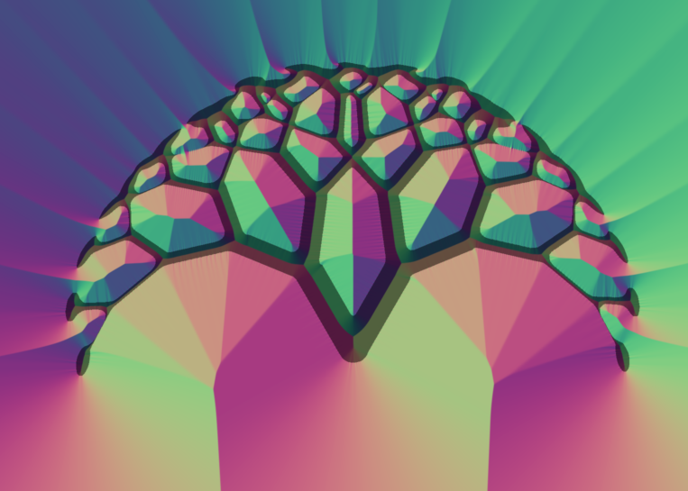

# 2D Sculpting

# Milestone IV

To run the fancy tree example, follow the same instructions as in milestone III. This should generate the below picture. The frontend python code used to generate the image is in examples.py (each getCmds() function is a separate example) and the code is compiled and run using interpretertest.jl in Julia. 



# Milestone III: Partial interpreter implementation
The interpreter in `interpreter.jl` can be run on the test described in the document by running `julia interpretertest.jl`.
This processes the input AST in the script `frontend.py` to produce the intermediate representation, which is then interpreted by `interpreter.jl`.

This assumes you have Julia installed, with the packages DataStructures, Plots, Images, and PyCall installed. To install a package, within the Julia command prompt execute:
```
using Pkg
Pkg.add(“PackageName”)
```
Then the above script should produce the same image as in the example in the document.
Note that runtimes appear to be long, but the vast majority of the time is spent loading packages. Julia is not meant to be reloaded for individual small tasks. However, the backend algorithms themselves are orders of magnitude faster than their python counterparts.


## Sculpting prototype
To see the results of the python implementation, run
```
python canvas.py
```
There will be a series of plots, each showing steps in the construction of various shapes (CSG operations followed by signed distance field updates, then shrinking and fattening).

To run the Julia tests, install IJulia with
```
Pkg.add("IJulia")
using IJulia
notebook()
```
in the Julia REPL. Then you can run `include("canvas.jl")` in a new notebook, or see the existing notebook in this directory.
Here is an example of the output of the sculpting prototype system:


## DSL code
A frontend that optimizes the intermediate representation is found in `frontend.py`, and an example program using this frontend is in `example.py`.
